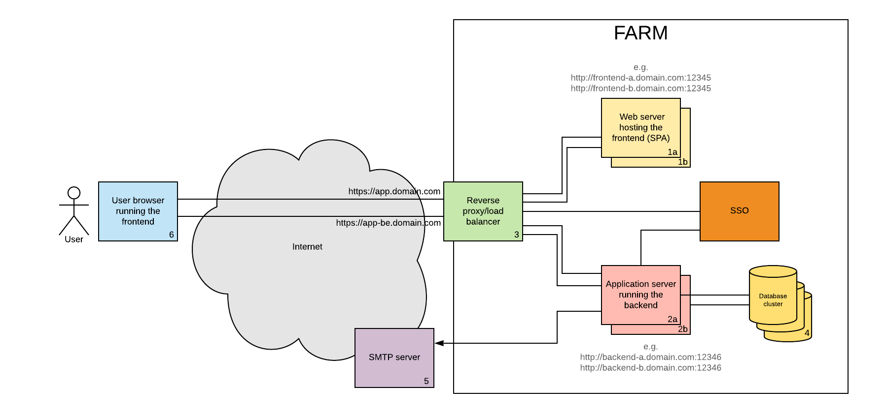

# Architettura di riferimento SPA

L'architettura è illustrata nella figura seguente.

* **1a/1b**: web server (per es. apache o nginx) che pubblicano le risorse appartenenti ai moduli di frontend, direttamente eseguibili nel browser dell'utente (plain .html, .css, .js, .ico files). I frontend sono replicati principalmente per questioni di alta affidabilità.
* **2a/2b**: application server che eseguono il backend applicativo, basati sull'ambiente di runtime utilizzato (Wildfly oppure net core). I backend espongono una API RESTful. Sono replicati principalmente per questioni di alta affidabilità e di scalabilità orizzontale. Nella configurazione di default tali application server ospitano anche i files di log applicativi (finché non sarà disponibile un log server centralizzato, in corso di predisposizione). Al fine di consentire la scalabilità orizzontale e l'aggiornamento applicativo senza interruzione del servizio, gli applicativi non devono salvare dati di sessione d'utente a bordo degli application server.
* **3**: è il componente che ha le funzioni di reverse proxy e load balancer. La strategia di load balancing non deve essere imposta, ma può essere una qualsiasi (per es. round-robin, sticky-session or hash-based). Assicura anche funzionalità basilari di protezione delle URL, intrusion detection, anomaly detection.
* **4**: il database applicativo. Può essere un database relazionale o documentale (Postgres oppure MongoDB).
* **5**: il server SMTP, utile laddove l'applicativo ha bisogno di fruire dei servizi di posta elettronica.
* **6**: il browser dell'utente, tra quelli attualmente supportati.
* **7**: è il single sign on dipartimentale. Si interfaccia con il browser dell'utente e con i moduli di backend, al fine di generare i componenti necessari a garantire l'autenticazione dell'utente (per es. JWT token). Le regole di autorizzazione, realizzate all'interno della logica applicativa, devono essere basate unicamente sull'autenticazione ottenuta mediante single sign on. 

Il browser d'utente deve poter raggiungere indifferentemente le URL di frontend e di backend, per il tramite del reverse proxy. L'applicazione deve essere servita su connessione protetta SSL.

Nell'immagine non sono rappresentati i componenti per la distribuzione automatizzata del codice sorgente (git, jenkins e relative chain di deploy).